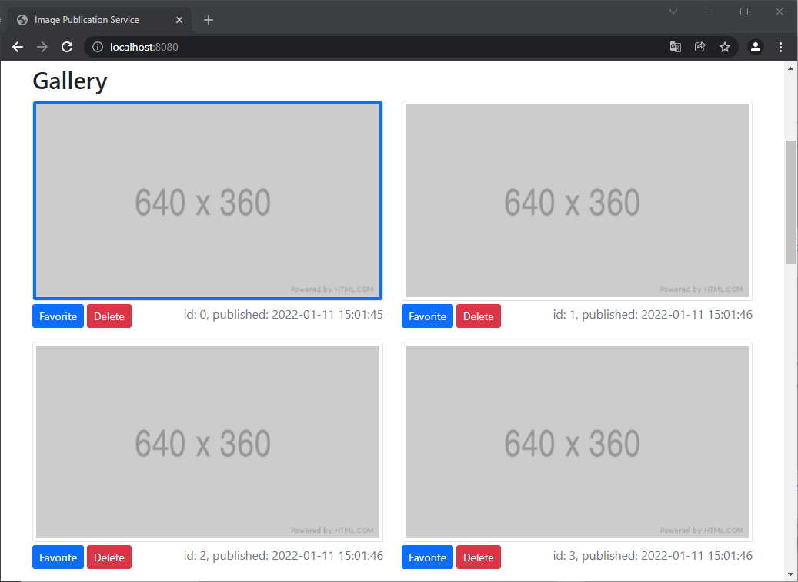

# Image Publication Service for the OOSC Exercise

A Spring Boot web service used in the Object-oriented Software Construction (OOSC) exercise as a basis for developing a RESTful web service. The web service has an API for uploading images, changing, and deleting images. The service comes with a small front end showing a gallery of all uploaded images. The gallery allows to delete images and mark images as favorite.



Images cannot be uploaded from the website but only via the API. 

The objective of this exercise is 
- to adapt an existing software prototype to changed requirements,
- to implement a RESTful API,
- to use dependency injection by implementing an interchangable storage backend for persisting uploaded images, and
- to implement the usage of the RESTful API from within the existing interior design / floorplanner application, which was developed in previous exercises.

## Prerequisites

- Java 11 (a newer version should also work)

## Build the web service

To build the web service, run `maven` with the goal `package` in the project directory: 

```
mvnw package
```

This will build an executable JAR file located in the directory:

```
<project directory>/target/
```

## Run the web service

To start the web service, run `maven` with the goal `spring-boot:run` in the project directory:

```
mvnw spring-boot:run
```

Alternatively, execute the JAR:

```
java -jar <project directory>/target/webservice-0.0.1-SNAPSHOT.jar
```

## Access the running web service

You can now access the web service using your web browser:

[`http://localhost:8080/`](http://localhost:8080/)
